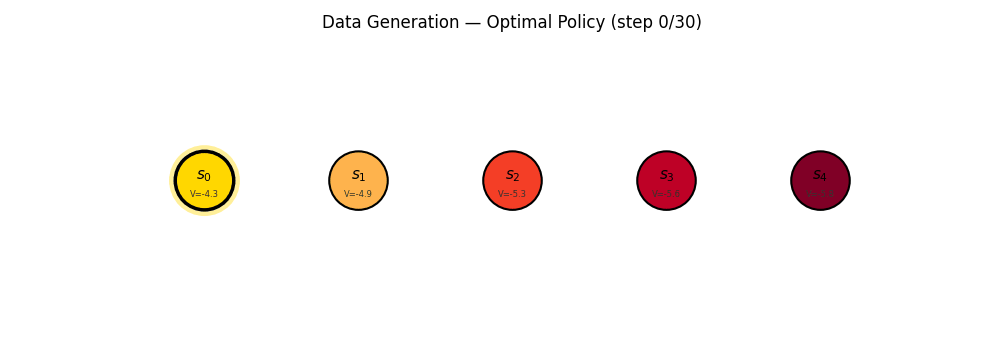
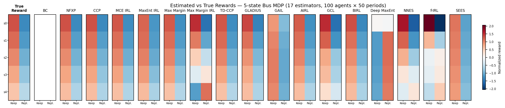

# econirl

Benchmarking dynamic discrete choice and inverse RL algorithms on a variety of MDPs — comparing reward recovery, imitation, and generalization.

## Install

```bash
uv pip install -e .
```

## Try It

```python
from econirl.evaluation.benchmark import BenchmarkDGP, run_single, get_default_estimator_specs

# 5-state bus engine replacement MDP (Rust 1987)
dgp = BenchmarkDGP(n_states=5, discount_factor=0.95)
specs = get_default_estimator_specs()

# Run all 18 estimators with benchmark-tuned defaults
for spec in specs:
    result = run_single(dgp, spec, n_agents=100, n_periods=50, seed=42)
    print(f"{result.estimator:12s}  {result.pct_optimal:6.1f}%  {result.time_seconds:5.1f}s")
```



### Results

| Estimator   | Category    | Recovers Params | Recovers Reward | % Optimal | % Transfer | Time   |
|-------------|-------------|:---------------:|:---------------:|----------:|-----------:|-------:|
| **Structural Estimators** | | | | | | |
| NFXP        | Structural  | Yes | Yes |  99.7% |  99.8% |  13.9s |
| CCP         | Structural  | Yes | Yes |  99.7% |  99.8% |  18.6s |
| SEES        | Structural  | Yes | Yes |  99.6% |  99.6% |  28.6s |
| NNES        | Structural  | Yes | Yes |  99.6% |  99.1% |  13.7s |
| **Entropy-Based IRL** | | | | | | |
| MCE IRL     | IRL         | Yes | Yes |  99.7% |  99.7% |  20.6s |
| MaxEnt IRL  | IRL         | No  | Yes |  98.2% |  97.8% |   9.1s |
| Deep MaxEnt | IRL         | No  | Yes |  98.3% |  98.2% |  52.3s |
| BIRL        | IRL         | No  | Yes |  99.5% |  99.5% | 237.8s |
| **Margin-Based IRL** | | | | | | |
| Max Margin  | IRL         | Yes | Yes |  99.3% |  99.3% |  64.8s |
| Max Margin IRL | IRL      | No  | Yes |  31.1% |  34.2% |   0.3s |
| **Distribution Matching** | | | | | | |
| f-IRL       | IRL         | No  | Yes |  99.1% |  99.1% |  44.9s |
| **Neural Estimators** | | | | | | |
| TD-CCP      | Neural      | Yes | Yes |  99.8% |  99.7% |  16.3s |
| GLADIUS     | Neural      | Yes | Yes |  99.6% |  88.7% |   4.2s |
| **Adversarial Methods** | | | | | | |
| GAIL        | Adversarial | No  | No  |  54.3% |  50.9% | 112.9s |
| AIRL        | Adversarial | No  | Yes |  99.4% |  99.5% | 123.0s |
| GCL         | Adversarial | No  | Yes |  92.7% |  95.3% | 166.5s |
| **Inverse Q-Learning** | | | | | | |
| IQ-Learn    | IRL         | No  | Yes |  96.3% |  95.9% |   0.0s |
| **Baseline** | | | | | | |
| BC          | Baseline    | No  | No  |  99.5% |  99.5% |   0.1s |

5-state MDP, 100 agents x 50 periods, seed=42. **% Optimal** = value achieved vs true optimal on training dynamics (baseline-normalized). **% Transfer** = same metric on held-out transition dynamics (same rewards, different wear rates). **Recovers Params** = recovers interpretable structural parameters. **Recovers Reward** = recovers a reward function (enables transfer to new dynamics).




## Algorithms

### Structural Estimators

Assume the econometrician knows the model and recover flow utility parameters by maximum likelihood.

| Algorithm | Paper | Method |
|-----------|-------|--------|
| NFXP      | [Rust (1987)](https://doi.org/10.2307/1911259) | Full-solution MLE via nested fixed point |
| CCP       | [Hotz & Miller (1993)](https://doi.org/10.2307/2298122) | Two-step conditional choice probability with NPL iterations |
| SEES      | [Luo & Sang (2024)](https://arxiv.org/abs/2404.12843) | Sieve basis V(s) approximation + penalized joint MLE |
| NNES      | [Nguyen (2025)](https://arxiv.org/abs/2501.14375) | Neural V(s) network (Bellman residual) + structural MLE |

### Entropy-Based IRL

Recover reward functions from demonstrations using maximum entropy or Bayesian principles.

| Algorithm   | Paper | Method |
|-------------|-------|--------|
| MCE IRL     | [Ziebart (2010)](https://www.cs.cmu.edu/~bziebart/publications/thesis-bziebart.pdf) | Maximum causal entropy IRL with soft value iteration |
| MaxEnt IRL  | [Ziebart et al. (2008)](https://cdn.aaai.org/AAAI/2008/AAAI08-227.pdf) | Maximum entropy IRL with state visitation frequencies |
| Deep MaxEnt | [Wulfmeier et al. (2016)](https://arxiv.org/abs/1507.04888) | Neural reward network + MaxEnt feature matching |
| BIRL        | [Ramachandran & Amir (2007)](https://www.ijcai.org/Proceedings/07/Papers/416.pdf) | Bayesian MCMC (Metropolis-Hastings) over reward parameters |

### Margin-Based IRL

Recover rewards by maximizing the margin between expert and non-expert behavior.

| Algorithm      | Paper | Method |
|----------------|-------|--------|
| Max Margin     | [Ratliff et al. (2006)](https://doi.org/10.1145/1143844.1143936) | Structured max-margin planning |
| Max Margin IRL | [Abbeel & Ng (2004)](https://ai.stanford.edu/~ang/papers/icml04-apprentice.pdf) | Apprenticeship learning via margin maximization |

### Distribution Matching

Match state-marginal distributions rather than feature expectations.

| Algorithm | Paper | Method |
|-----------|-------|--------|
| f-IRL     | [Ni et al. (2022)](https://arxiv.org/abs/2011.04709) | State-marginal matching via f-divergences (KL, chi-squared, TV) |

### Neural Estimators

Approximate value functions with neural networks for scalability to large state spaces.

| Algorithm | Paper | Method |
|-----------|-------|--------|
| TD-CCP    | [Adusumilli & Eckardt (2022)](https://arxiv.org/abs/1912.09509) | TD-learning + CCP with neural approximate value iteration |
| GLADIUS   | [Kang, Yoganarasimhan & Jain (2025)](https://arxiv.org/abs/2502.14131) | Dual Q + EV networks with Bellman consistency penalty |

### Inverse Q-Learning

Recover reward and policy by learning a single soft Q-function, avoiding adversarial training.

| Algorithm | Paper | Method |
|-----------|-------|--------|
| IQ-Learn  | [Garg et al. (2021)](https://arxiv.org/abs/2106.12142) | Inverse soft-Q learning with chi-squared divergence |

### Adversarial Methods

Learn reward or policy via a discriminator that distinguishes expert from generated behavior.

| Algorithm | Paper | Method |
|-----------|-------|--------|
| GAIL      | [Ho & Ermon (2016)](https://arxiv.org/abs/1611.03852) | Generative adversarial imitation learning |
| AIRL      | [Fu et al. (2018)](https://arxiv.org/abs/1710.11248) | Adversarial inverse RL with disentangled reward |
| GCL       | [Finn et al. (2016)](https://arxiv.org/abs/1603.00448) | Guided cost learning with importance sampling |

### Baseline

| Algorithm | Paper | Method |
|-----------|-------|--------|
| BC        | — | Supervised: empirical P(a\|s) from demonstrations |

## [Pseudocode](docs/pseudocode.md)

## License

MIT
